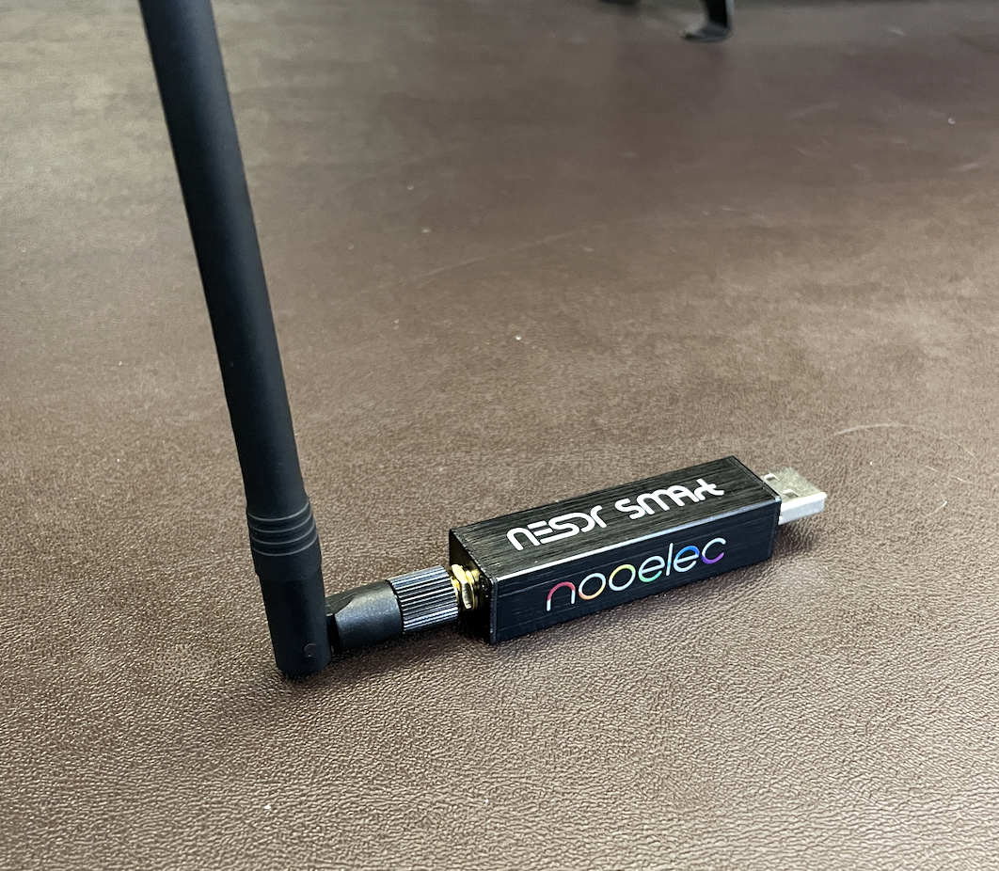
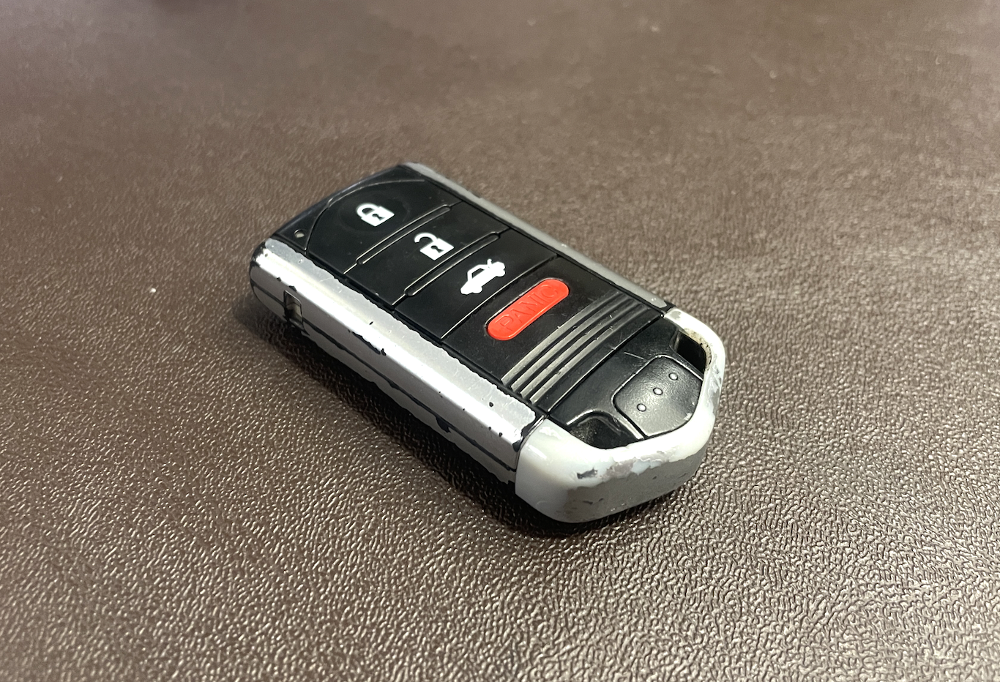
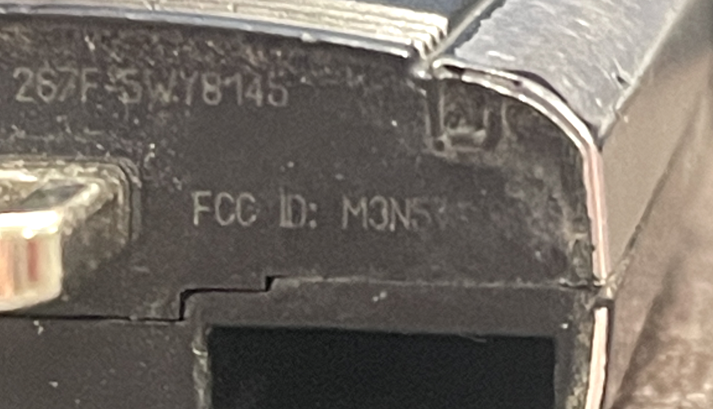
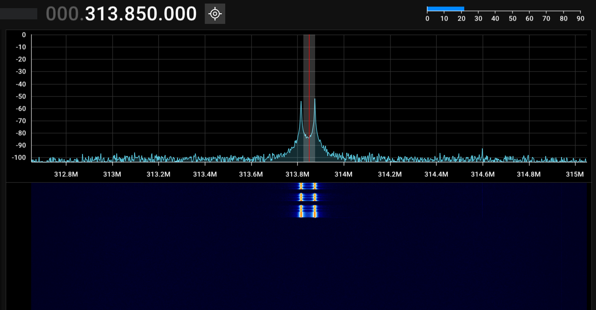
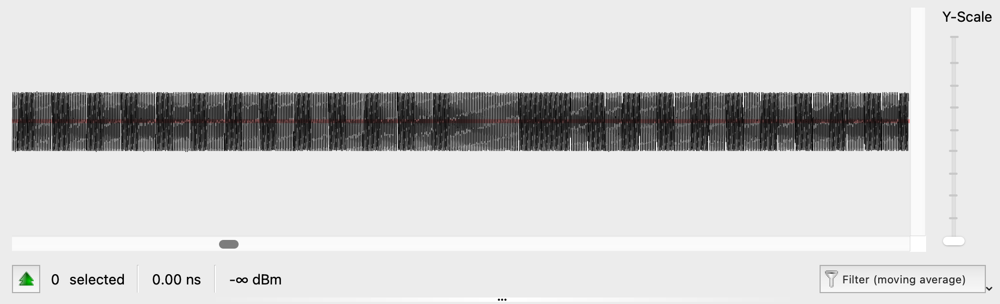
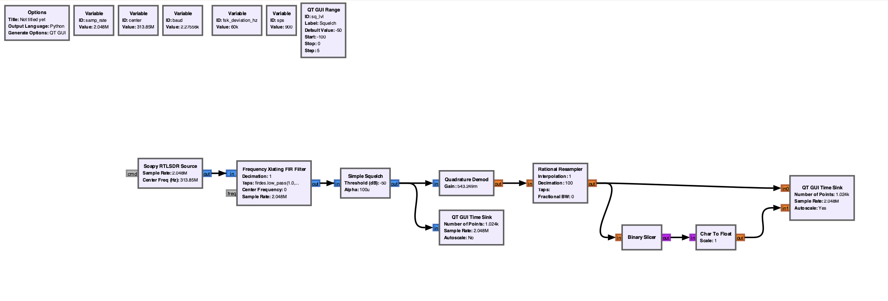

# keyfob-gnuradio
This project is an attempt to learn a little bit more about the protocol that drives my car's wireless key fob.
By using data published by the FCC as well as some open source tools, we can learn a decent amount about what's going on.

### Goals
* Recieve, demodulate, and interpret the signals from a car key fob
* Understand a little more about Honda/Acura's rolling code implementation
* (maybe) Identify potential vulnerabilities.

### Hardware
I am using the following pieces of hardware for this research:
* NooElec NESDR Smart (RTL-SDR)
* Generic UHF monopole antenna from Amazon

* My car key

### Software
* [GNURadio](https://www.gnuradio.org/) - implementing the final decoding pipeline
* [Universal Radio Hacker](https://github.com/jopohl/urh)- reverse engineering the protocol
* [SDR++](https://github.com/AlexandreRouma/SDRPlusPlus) - roughly searching for the fob's signal
* Python - data processing, GNURadio extensions

## Part 1: Background
Modern cars have a few different features that can be accessed by the key fob.
Most can lock and unlock the car, open the trunk, trigger a panic alarm, and some can even remotely start the car.
A simple method of implementing this would be to use a fixed frequency that corresponds to a certain action,
(315.014MHz opens the trunk, etc.) but this is easily defeated, 
just transmit at the frequency that unlocks the car and you're in.
What if instead, we used a specific sequence of bits instead? That's all well and good, 
but unfortunately then all of our cars would be vulnerable to a so-called "replay" attack.
Even if every car had a unique set of bits that needed to be transmitted in order to unlock the car,
we could simply record the sequence for a certain car and "replay" it to get in.
So, how do we protect against that? The answer is to use a "rolling" code. 
In one version of this architecture, the transmitter and reciever share a cryptographically secure pseudo-random number generator (PRNG).
This PRNG is used to generate a cryptographic key which is then used to encrypt the command sent by the transmitter.
The reciever can then use its PRNG, with the same seed as the transmitter, to decrypt the recieved data and act upon it.
The key (haha) to this method's security is the fact that ***after every transmission, the key is regenerated and a used key is made invalid***.
This means that even if you play back a previously used "unlock" message, it will not work since you're reusing a discarded key.

## Part 2: Finding the signal
I started out by exploring the frequencies around 315MHz and trying to track down my car's key fob.
I quickly realized that this was probably going to be pretty difficult, and also discovered that there were a lot
of harmonics being kicked off by the key fob's transmitter as well. 

Eventually I remembered that the FCC actually keeps records of all of the little RF knick-knacks like my key,
*and* I remembered that all devices have to display their FCC ID. Sure enough, there it was, on the bottom of my key.
It's a little hard to read, but under a microscope I got it: [M3N5WY8145](https://fccid.io/M3N5WY8145).

 In the FCC filing was the exact frequency, 313.850 MHz, and sure enough when I tried it in SDR++ I saw the following:

There's our data! We can see the real and imaginary parts of the signal above and below our center frequency,
and three distinct "packets" of communication. 

## Part 3: Universal Radio Hacker
Now that I knew where my signal was, I needed to figure out how it was encoded and what datarate it was. I considered developing a tool in GNURadio to do this, but I did some digging to try to find other tools that would work and stumbled upon [Universal Radio Hacker](https://github.com/jopohl/urh). This tool is specifically designed for reverse engineering radio protocols, and features basically all of the tools I would need to be able to figure out how my car key is communicating with the car. 

I started out by using URH to capture a transmit keypress, shown below. 

Here, you can distinctly see the two different frequencies transmitted by the key which is pretty neat, 
and running URH's analyzer feature gives us another important piece of information: the number of samples per symbol period.
It discovered that there are 900 SDR samples per bit time, which works out to a baud rate of about 2.275kBaud.
I'm guessing that this number is probably slightly off, but tuning the samples/symbol number in both GNURadio and URH didn't
provide a noticeable improvement in the decoding of the signal, instead just throwing it off if the samples/symbol became far
enough from the baseline.

## Part 4: GNURadio 
Now that we know the encoding is BFSK at around 2.275kBaud, we can build a simple GNURadio flowgraph to decode it. 

I started out with a Soapy RTLSDR source that would allow me to connect my SDR to GNURadio, 
and set the center frequency to the 313.85MHz that I previously found with the FCC filing.
I then used a Frequency XLating FIR filter to "channelize" the signal into the bandwidth that it actually takes up,
and a squelch to remove the background when not transmitting. The block that does most of the heavy lifting in this setup is
the Quadrature Demod block that takes the I/Q signal from the SDR and converts it into a single ended floating point signal.
I then resample this, slice it into a binary on-off signal, and finally output it to a Qt time series sink. 